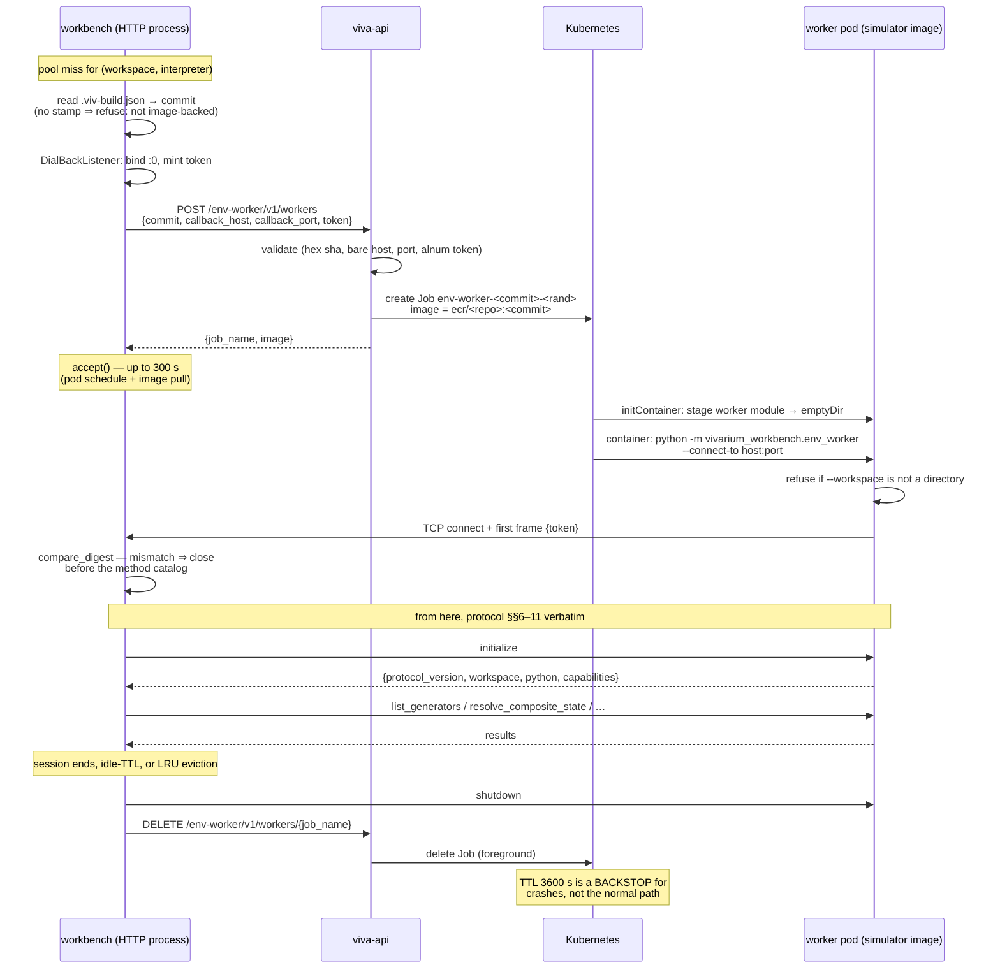

# Env-worker runtime — how a workspace environment is obtained

Where the workbench gets a **runnable environment** for a workspace, and what the
lifecycle looks like end to end. Two mechanisms exist, chosen by *deployment
topology*, and both speak the identical protocol.

Companions: [`env-worker-protocol.md`](env-worker-protocol.md) is the wire
contract (§5 local transport, §5A dial-back); `REFACTOR-PLAN.md` **§2A.7** decided
the worker model and **§2A.8** decided that hosted runs the simulator's own image.
This doc is the *operational* view those two leave implicit.

> **Status (2026-08-28).** Both mechanisms are implemented, proven on
> `sms-api-stanford-test`, and now **wired into request paths** (#952, corrected
> by #954; deployed as 0.3.63–0.3.65). See [Current status](#current-status).
>
> A further decision is on record but **not built**: env-worker traffic is to be
> proxied through sms-api, which would own queuing, durability and status — see
> [`run-orchestration-consolidation.md`](run-orchestration-consolidation.md) §E.
> Nothing below describes that yet; this doc still documents the direct
> dial-back runtime as it runs today.

---

## The two ways to get an environment

| | **Local** (a laptop) | **Hosted** (image-as-worker) |
|---|---|---|
| Where the worker runs | subprocess of the workbench | its own **Kubernetes Job** |
| Where the environment comes from | the workspace's own `.venv` | the simulator's **prebuilt image** for `(repo, commit)` |
| Transport | `socketpair` (protocol §5) | **dial-back TCP** (protocol §5A) |
| Who creates it | `subprocess.Popen` | **viva-api** — the workbench has no cluster access (§2B.2) |
| Selected by | no dial-back host configured | `VIVARIUM_WORKBENCH_ENV_WORKER_ADVERTISE_HOST` is set |

**The choice is structural, not a preference.** `env_worker_launcher.default_launcher()`
returns the remote launcher **iff** the deployment declares where workers should
dial back, and the local one otherwise — because a laptop has no cluster. One
wiring decision at the composition root (§5C.4); there is no per-call switch to
cherry-pick, which is what stops the two implementations drifting into
alternatives someone chooses between.

Hosted **never builds an environment.** The image *is* the environment coordinate
(§2A.2): rebuilding it on the volume would be a second source of truth that can
drift from the one the science actually ran under.

---

## Components

```
  ┌───────────────────── workbench pod ─────────────────────┐
  │  HTTP process (imports NO workspace Python, §2A.7)      │
  │    get_pool() ── WorkerPool ── launcher ─┐              │
  │                   warm, LRU, idle-TTL    │              │
  │    DialBackListener  ◀───────────────────┼──────┐       │
  │      ephemeral port + one-time token     │      │       │
  └──────────────────────────────────────────┼──────┼───────┘
                     │ POST /env-worker/v1/workers  │ dial-back
                     ▼                              │ TCP + token
  ┌──────── viva-api ────────┐                      │
  │  EnvWorkerService        │  creates             │
  │  → K8sJobService         │────────────┐         │
  └──────────────────────────┘            ▼         │
                        ┌───────── worker pod (a Job) ───────┐
                        │ initContainer stage-worker-module  │
                        │   copies __init__.py + env_worker  │
                        │   + lib/  (6.1 MB of a 215 MB pkg) │
                        │            ↓ emptyDir              │
                        │ container: SIMULATOR IMAGE         │
                        │   python -m …env_worker            │
                        │   PYTHONPATH=/opt/env-worker  ─────┘
                        │   workspace = the image's checkout │
                        └────────────────────────────────────┘
```

Two `emptyDir` volumes, no PVC. The worker is **stateless with respect to the
scientific record** — specs travel in protocol messages (§2A.2's composite-code
boundary rule) — which is exactly what frees it from the workspace volume's
`ReadWriteOnce` single-node binding and lets it schedule anywhere.

---

## Lifecycle



---

## What runs where

- **The HTTP process imports no workspace Python** (§2A.7). Every environment
  fact comes through the protocol.
- **The worker answers interactive queries only** — `list_generators`,
  `resolve_composite_state`, light viz. Simulations and heavy analyses are
  **jobs**, not worker calls (protocol §12), which is why a worker pod is sized
  for interaction: `250m`/`512Mi` requests, `1`/`2Gi` limits.
- **The worker's workspace is the image's own checkout** (`/app/v2ecoli` by
  default), not the PVC. Under §2A.8 that copy *is* the environment; the PVC copy
  is the mutable record.

## Configuration

| Setting | Side | Meaning |
|---|---|---|
| `VIVARIUM_WORKBENCH_ENV_WORKER_ADVERTISE_HOST` | workbench | Where workers dial back — this pod's IP, via the Downward API. **Setting it is what selects the remote launcher**; blank counts as unset. |
| `ENV_WORKER_MODULE_IMAGE` | viva-api | The workbench image a Job stages its worker module from. **Must equal the deployment's `vivarium-workbench` tag** — same code, or a workbench speaks a protocol its own workers don't. |
| `ENV_WORKER_WORKSPACE_PATH` | viva-api | Workspace root inside the simulator image. Default `/app/v2ecoli`. |
| `ENV_WORKER_POOL_MAX` (8) · `ENV_WORKER_IDLE_TTL` (900 s) · `ENV_WORKER_CALL_TIMEOUT` (60 s) | workbench | Warm-pool size, idle eviction, per-call socket timeout (protocol §17). |

**Invariant:** every hosted served workspace must be **image-backed**. A workspace
with science code but no built image cannot answer environment questions; the
launcher refuses up front rather than failing inside a call.

## Failure modes, and what each looks like

| Symptom | Cause |
|---|---|
| `workspace … has no build stamp (.viv-build.json)` | not image-backed — refused before any Job is created |
| `env worker … did not connect` **with the worker's logs attached** | the pod never dialled back; the Job is deleted rather than left to TTL |
| worker exits 2, `unrecognized arguments: --connect-to` | `ENV_WORKER_MODULE_IMAGE` points at a workbench older than the dial-back transport |
| `--workspace … is not a directory` | `ENV_WORKER_WORKSPACE_PATH` wrong. **This guard exists because the alternative is silent:** `_list_generators()` falls back to a *global* scan when the workspace can't be imported, returning a populated, plausible, **wrong** list (measured: 53 generators vs the correct 33, 19 of them from an unrelated package) |
| HTTP 409 from `POST /workers` | a Job of that name exists or is still terminating |

**Health check that actually proves it works** — `initialize`/`ping` pass even
when the workspace is wrong:

```
list_generators against a sim82 workspace
  → workspace=/app/v2ecoli   generators=33   spatio_flux=0
```

A non-zero count of unrelated packages means the worker fell back to the global
scan. Run a **second** launch too — that is what catches Job-name collisions.

## Current status

Workstreams 1–3 and 5 of §2A.8 are done and deployed to `sms-api-stanford-test`.

**Workstream 8 step 1 is now done too** (#952, corrected by #954). `get_pool()`
consults `default_launcher()`, so **transport follows deployment topology for
every method** — the earlier note here, that `default_launcher()` was called by
nothing and all 25 call sites spawned local subprocesses, is superseded.

#952 first routed *per method* — interactive remote, job-class local — which
inverted this doc's own rule and could not work on a hosted deployment at all:
nothing there has a `.venv`, so every job-class call raised
`workspace has no .venv`. #954 corrected the axis.

**Step 2a** (#957, 0.3.64) makes run entrypoints honor
`remote_pinned.resolve_run_target`. **Step 2b**, the declared-scale precheck, is
**not started and is now load-bearing**: with transport no longer standing in for
a cost policy, nothing separates a small in-context run from one that must
dispatch.

Design: [`env-worker-routing.md`](env-worker-routing.md). Wider plan, including
the decision to proxy through sms-api:
[`run-orchestration-consolidation.md`](run-orchestration-consolidation.md).
